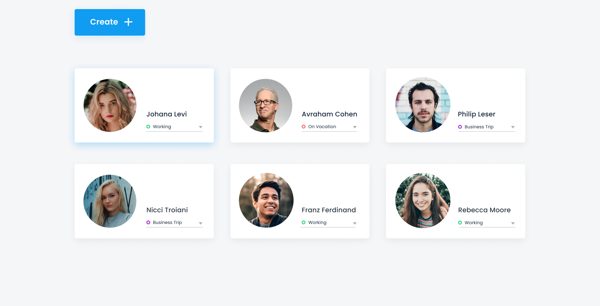
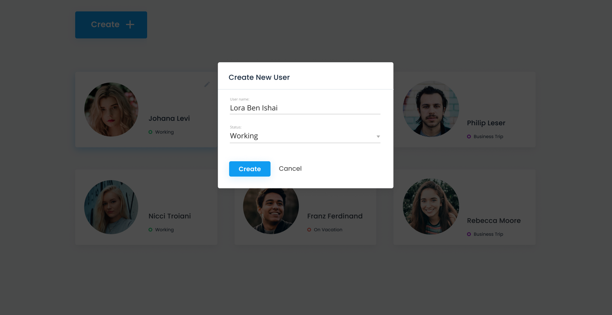

## Task
### General:
Our server receives employee status changes
Apollo GraphQL Rest API server
Status can be one of the following:
1.  Working
2. OnVacation
3. LunchTime
4. BusinessTrip

### APIs:
- Get list of employees
- Update the status of an employee
- Create a new employee

#### Environment:
- Please create an Apollo GraphQL server to answer the above requirements
- Please set up a MongoDB database to store the employee data
- Please create a React app and make sure you have basic connectivity with the server

### Requirements:
- Enable the user to see a list of all employee
- Enable the user to update the status of an employee card dropdown
- Enable the user to create a new employee

### Notes:
The system should be working as expected and convenient
Keep clean code and proper functionality
You can use a local version of MongoDB or the free version of MongoDB by Atlas: https://www.mongodb.com/atlas/databas
No need for pixel perfect components, but we do want components to be styled
If you can upload the solution (without node modules) to google drive and share a link that would be better

### Bonus:
Implement delete employee functionality E2E

### Mockups:




## Setup

### MongoDB
Change MONGODB_URL variable for mongodb connection in .env fife

### Install dependencies
```
npm run install:all
```

### Start backend
```
npm run start:backend
```

### Start frontend
```
npm run start:frontend
```

### Enjoy your app!!!
